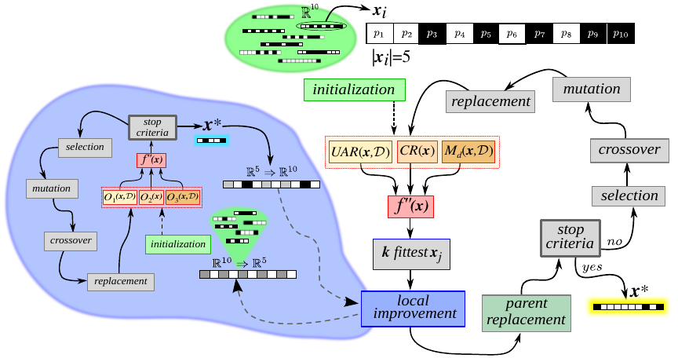

# MOELIGA: Multi-Objective Evolutionary Learning for Intelligent Genetic Algorithm

[](https://arxiv.org/abs/2603.20934)
[](https://creativecommons.org/licenses/by/4.0/)

MOELIGA is an open-source framework for **wrapper-based multi-objective feature selection** using a parallel evolutionary algorithm. It simultaneously optimizes classification accuracy, feature reduction, and feature relevance, producing a Pareto front of non-dominated solutions. The core algorithm is implemented in C++ with MPI parallelization; a Python layer handles experiment management, statistical analysis, and reporting.

This repository contains the source code associated with the following paper:

> **MOELIGA: a multi-objective evolutionary approach for feature selection with local improvement**
> Leandro Vignolo, Matias Gerard
> *[under revision]*, 2026.
> arXiv: [https://arxiv.org/abs/2603.20934]

---

## Table of Contents

1. [Algorithm Overview](#algorithm-overview)
2. [Key Features](#key-features)
3. [Repository Structure](#repository-structure)
4. [Installation](#installation)
5. [Configuration](#configuration)
6. [Usage](#usage)
7. [Output Files](#output-files)
8. [Citation](#citation)
9. [License](#license)

---

## Algorithm Overview

MOELIGA frames feature selection as a **three-objective optimization problem**: maximize classification accuracy (UAR), maximize feature reduction (fewer selected features), and maximize a Relief-based feature relevance measure. Each candidate solution is a binary chromosome where each bit indicates whether the corresponding feature is included.

The search is driven by a **Multi-Objective Genetic Algorithm (MOGA)** with Pareto-based ranking and fitness sharing, which maintains a diverse set of non-dominated solutions along the Pareto front. An optional **island model** runs independent sub-populations that periodically inject their best individuals into the main population, promoting further diversity. Fitness evaluation is parallelized via MPI, making MOELIGA suitable for high-dimensional datasets.



*Figure: MOELIGA's two-level evolutionary structure. The main population (left, blue) evolves with standard GA operators and multi-objective fitness. Sub-populations (center) evolve independently and contribute their best individuals via local improvement and parent replacement. Right: detail of the sub-population cycle showing selection, crossover, mutation, and stopping criteria.*

---

## Key Features

- **Multi-objective optimization** with 2 or 3 configurable objectives
- **MOGA-based Pareto ranking** with three fitness sharing strategies (rank-based, mean-rank-distance, cluster-based)
- **Island model** with configurable sub-populations and replacement strategies
- **Adaptive mutation** with exponential decay schedule
- **Sigmoid transformation** for non-linear scaling of the feature-count objective
- **Parallel MPI fitness evaluation** for high-dimensional datasets
- **7 classifiers** via [mlpack](https://www.mlpack.org/): Decision Tree, Random Forest, AdaBoost, SVM, Naive Bayes, MLP, RBF Network
- **9 gradient optimizers** for neural classifiers (SGD, Adam, AdaMax, AmsGrad, Nadam, Nadamax, RMSProp, AdaDelta, AdaGrad)
- **Python experiment manager** with parameter grid search, checkpointing, and optional Telegram notifications
- **Automated analysis pipeline**: per-experiment summaries, cross-repetition statistics (mean, median, std, MAD, 95% CI), and Excel reporting

---

## Repository Structure

```
MOELIGA/
├── c++/
│   ├── GA/              # Core MOGA algorithm (agp.cpp) with MPI parallelization
│   ├── fitness/         # Classifier fitness evaluation via mlpack
│   └── configs/         # Configuration file parser (Toolbox.hpp)
├── libRunner/           # Python post-processing library
│   ├── single_experiment.py   # Parse and analyze a single experiment run
│   ├── multiple_runs.py       # Aggregate statistics across repetitions
│   └── report_builder.py      # Build final Excel report
├── data/
│   ├── ARFFbuilder.py   # Convert raw data to ARFF format
│   └── Gisette/         # Example dataset (5,000 features)
├── other_methods/       # Baseline feature selection algorithms for benchmarking
├── settings/            # Per-dataset .cfg configuration files (12+ datasets)
├── runner.py            # Experiment grid runner (parameter sweep)
├── analyzer.py          # Results analysis pipeline
├── runner_settings.yaml # Parameter grid definition
└── Makefile
```

---

## Installation

### C++ Dependencies

```bash
# Ubuntu / Debian
sudo apt install libmlpack-dev libmlpack3 libensmallen-dev \
                 libarmadillo-dev libboost-dev mpich
```

| Library | Purpose |
|---------|---------|
| [mlpack](https://www.mlpack.org/) | Machine learning classifiers |
| [Armadillo](http://arma.sourceforge.net/) | Linear algebra |
| [ensmallen](https://ensmallen.org/) | Gradient optimizers |
| [Boost](https://www.boost.org/) | C++ utilities |
| [MPICH](https://www.mpich.org/) | MPI parallelization |

> Compile MOELIGA with the same compiler used for MPICH to avoid ABI incompatibilities.

### Python Dependencies

Python ≥ 3.7 is required.

```bash
pip install numpy scipy pandas matplotlib seaborn pyyaml \
            celluloid openpyxl python-telegram-bot
```

### Compilation

```bash
make all      # Full build: GA algorithm + fitness binary + test binary
make ubuntu   # Ubuntu-specific build
make ag       # Build GA algorithm only
```

Compiled binaries are placed in `./bin/`: `bin/agp` (main algorithm), `bin/fitness` (MPI fitness worker), `bin/test` (test-set evaluator).

### MPI Setup

```bash
export PATH=$PWD:$PATH
mpdboot -n 1    # Start local MPI daemon
mpdtrace        # Verify (should print hostname)
```

---

## Configuration

All algorithm parameters are set in a `.cfg` file. Ready-to-use configuration files for 12+ datasets are provided in `settings/` (e.g., `settings/gisette_SETTINGS.cfg`). The most important parameters are listed below; the full set — including classifier hyperparameters, optimizer settings, sub-population details, and stopping criteria — is documented with inline comments in those files.

### Essential Parameters

| Parameter | Type | Default | Description |
|-----------|------|---------|-------------|
| `trnfile` | string | — | Training dataset path (ARFF format) |
| `tstfile` | string | — | Test dataset path (ARFF format) |
| `Ngenes` | int | — | Chromosome length (= number of features in the dataset) |
| `outdir` | string | — | Output directory for results |
| `NProcesos` | int | — | Number of MPI worker processes for parallel fitness evaluation |
| `NObjetivos` | int | `3` | Number of objectives: `2` (UAR + reduction) or `3` (+ Relief) |
| `classifier` | string | `"DT"` | Classifier used during evolution (`DT`, `RF`, `ADA`, `SVM`, `NB`, `MLP`, `RBF`) |
| `test_classifier` | string | `"DT,RF,ADA,SVM,NB"` | Comma-separated classifiers for final test evaluation |
| `Nindividuos` | int | `20` | Main population size |
| `Gmax` | int | `300` | Maximum number of generations |
| `FitnessOption` | int | `3` | Fitness sharing: `1` = rank-based, `2` = mean-rank-distance, `3` = cluster-based |
| `SigmaShare` | float | `0.04` | Niche radius σ (controls diversity pressure) |
| `Obj2Sigmod` | bool | `True` | Apply sigmoid transformation to the feature-reduction objective |
| `SigmLambda` | float | `0.5` | Sigmoid steepness λ (active when `Obj2Sigmod=True`) |
| `Exponencial` | bool | `True` | Use exponential mutation decay |
| `GammaINI` | float | `10.0` | Initial mutation multiplier Γ_INI |
| `GammaFIN` | float | `0.1` | Final mutation multiplier Γ_FIN |
| `NSubPoblaciones` | int | `0` | Number of sub-populations (`0` = island model disabled) |

---

## Usage

### 1. Single Run

```bash
mpdboot -n 1
./bin/agp cfg settings/gisette_SETTINGS.cfg

# Run in background (persists after terminal close)
./bin/agp cfg settings/gisette_SETTINGS.cfg </dev/null &
```

Output files are written to the directory specified by `outdir` in the `.cfg` file.

---

### 2. Parameter Grid Search

`runner.py` sweeps over parameter combinations and runs multiple independent repetitions, with checkpointing support.

**Define the grid** in `runner_settings.yaml`:

```yaml
PARAMETERS:
  NObjetivos: [2, 3]
  Obj2Sigmod: [True, False]
  SigmLambda: [0.5, 1.5, 15.0]
  SigmaShare:  [0.0025, 0.005, 0.025]

# DEPENDENCIAS: SigmLambda is only swept when Obj2Sigmod=True
DEPENDENCIAS:
  Obj2Sigmod: ['SigmLambda']
```

**Run:**

```bash
python runner.py \
  --experiment_settings runner_settings.yaml \
  --eliga_settings settings/gisette_SETTINGS.cfg \
  --experiment_path ./results/gisette/ \
  --repetitions 10
```

| Argument | Description |
|----------|-------------|
| `-s`, `--experiment_settings` | YAML file with parameter grid |
| `-e`, `--eliga_settings` | Base `.cfg` file for the algorithm |
| `-p`, `--experiment_path` | Root directory for all output files |
| `-r`, `--repetitions` | Independent runs per parameter combination |
| `--resume` | Resume from a previous checkpoint |
| `-n`, `--notification` | Send a Telegram notification on completion |

---

### 3. Analyze Results

```bash
python analyzer.py \
  --experiment_path ./results/gisette/ \
  --experiment_settings runner_settings.yaml \
  --library_path libRunner/ \
  --n_jobs 4
```

This runs three sequential stages:
1. Parse each `.train`/`.test` file → `experiment_summary.json`
2. Aggregate across repetitions → `repetitions_summary.csv` + plots
3. Collect all CSVs → `final_report.xlsx`

---

### 4. Prepare a Custom Dataset

MOELIGA expects datasets in [ARFF format](https://waikato.github.io/weka-wiki/formats_and_processing/arff/). To convert raw data:

```bash
python data/ARFFbuilder.py \
  -data path/to/features.txt \
  -label path/to/labels.txt \
  -name my_dataset
```

- `features.txt`: space-separated float values, one sample per row.
- `labels.txt`: integer class labels, one per row.

Then update your `.cfg` file:
```
trnfile="data/my_dataset_train.arff"
tstfile="data/my_dataset_test.arff"
Ngenes=<number_of_features>
```

---

## Output Files

| File | Format | Description |
|------|--------|-------------|
| `*.train` | YAML | Per-generation statistics: fitness, Pareto front, feature histograms, mutation rates |
| `*.test` | JSON | Test-set evaluation: confusion matrices and metrics per classifier |
| `experiment_summary.json` | JSON | Aggregated single-run summary |
| `repetitions_summary.csv` | CSV | Cross-repetition statistics (mean, median, std, MAD, 95% CI) |
| `final_report.xlsx` | Excel | Comparative table across all parameter combinations |
| `plots/*.pdf`, `plots/*.png` | PDF + PNG | Evolution curves, Pareto front visualizations, feature heatmaps |

Performance metrics reported include: Accuracy, UAR, Precision, Recall, Specificity, F1, F1-Macro, F1-Weighted, and Cohen's Kappa.

---

## Citation

If you use MOELIGA in your research, please cite:

```bibtex
@article{moeliga2026,
  title   = {[MOELIGA: a multi-objective evolutionary approach for feature selection with local improvement]},
  author  = {[Leandro Vignolo] and [Matias Gerard]},
  journal = {[under revision]},
  year    = {2026},
  note    = {arXiv preprint: [https://arxiv.org/abs/2603.20934]}
}
```

> The arXiv link will be updated upon publication.

---

## License

This work is licensed under a [Creative Commons Attribution 4.0 International License](https://creativecommons.org/licenses/by/4.0/).

You are free to share and adapt this material for any purpose, provided appropriate credit is given to the original authors.
